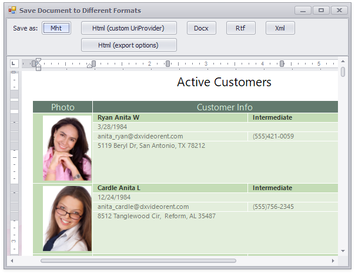

<!-- default badges list -->

<!-- default badges end -->

# Rich Text Editor for WinForms - How to Save the Document Range in Different Dormats

This example illustrates API methods used to get the text of the [document range](https://docs.devexpress.com/WindowsForms/6979) in different formats - RTF, HTML, MHT, DOCX.

## Files to Review

* [Form1.cs](./CS/GetTextMethodsExample/Form1.cs) (VB: [Form1.vb](./VB/GetTextMethodsExample/Form1.vb))
* [frmBrowser.cs](./CS/GetTextMethodsExample/frmBrowser.cs) (VB: [frmBrowser.vb](./VB/GetTextMethodsExample/frmBrowser.vb))
* [Program.cs](./CS/GetTextMethodsExample/Program.cs) (VB: [Program.vb](./VB/GetTextMethodsExample/Program.vb))

## Documentation

* [Positions and Ranges](https://docs.devexpress.com/WindowsForms/6979)
* [Import and Export](https://docs.devexpress.com/WindowsForms/9333)

<!-- feedback -->
## Does this example address your development requirements/objectives?

 

(you will be redirected to DevExpress.com to submit your response)
<!-- feedback end -->
